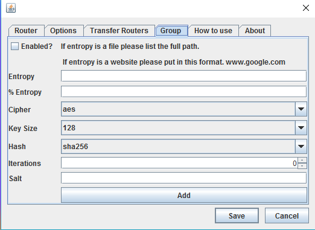
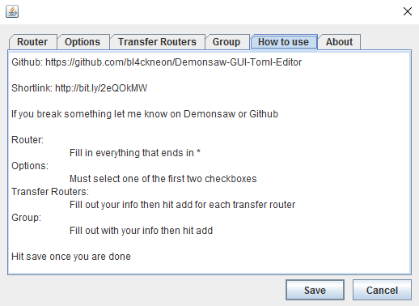

# Demonsaw-GUI-Toml-Editor
A GUI TOML Editor written in java.

This is used to configure a headless router (CLI Router). When the CLI client comes out, the project will be updated to work with the client.

